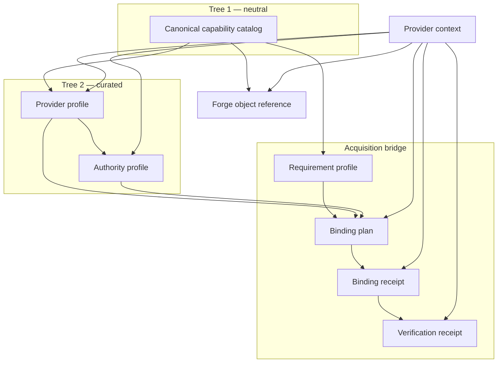
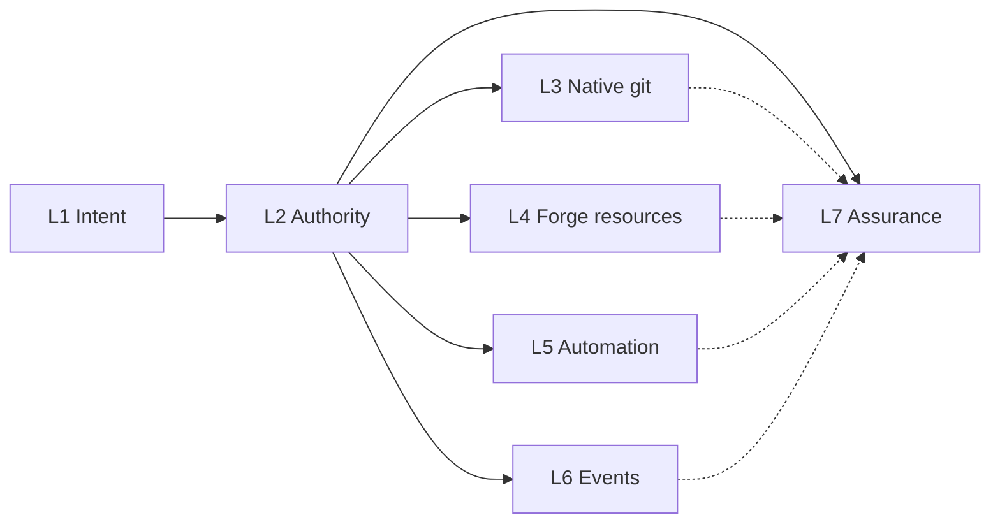

# Using the Forge Infrastructure Contract

The [portable forge-infrastructure standard](../standards/forge-infrastructure-contract.md)
is the law. This guide is the tour: what the contract is for, the objects a
reader will meet, how information flows, and what it deliberately is not.
Where this guide and the standard disagree, the standard wins.

Companion machine objects live under
[`schemas/forge-infra/v0/`](../../schemas/forge-infra/v0/). Decision:
[ADR-0009](../decisions/ADR-0009-forge-infrastructure-contract.md).

## One-sentence version

An actor wants a git stratum with **capabilities** and **requirements**.
This contract **resolves and binds access honestly**. It does not wrap `gh`,
store secrets, or replace git.

## Four heads (read this first)

The contract looks like one SDK. It is four coupled concerns. Mixing them
is how a reader concludes we wrapped `gh`.

| Head                          | Job                                                                                                                                                                                                                  | Lane            |
| ----------------------------- | -------------------------------------------------------------------------------------------------------------------------------------------------------------------------------------------------------------------- | --------------- |
| **Access brokerage**          | Mint apps / bind privileges; map grants the provider actually has                                                                                                                                                    | L1, L2, catalog |
| **Git-stratum CRUD**          | Catalog both `forge.repository.remote` (hosted container) and `forge.repository.content` (read/create/update/delete via native git or a mapped contents API). No blob/tree/commit schema, git CLI, or provider proxy | L3              |
| **Async comms**               | Infrastructure notifies us, or we notify it (statuses, checks, subscriptions)                                                                                                                                        | L6              |
| **Health / management facts** | Dated evidence, live grant verification, drift, teardown. A live health _stream_ is `process-run`, not a fourth tree                                                                                                 | L7              |

A remote that is “just git” (including git stored on object storage) may need
only L3. Issues, runners, and webhooks are why L4–L6 exist.

## What it is / is not

| It is                                                          | It is not                                    |
| -------------------------------------------------------------- | -------------------------------------------- |
| A capability-resolution and authority-control model            | A common provider SDK                        |
| Two trees: **neutral catalog** + **curated provider profiles** | Fake feature parity                          |
| Non-secret receipts of mint/bind/verify                        | A credential or session store                |
| Facts a policy engine may consume                              | The policy engine (no OPA/Rego inside)       |
| A locator for forge-native objects                             | The published bag of bytes (`data-artifact`) |

GitHub is far ahead of GitLab and Forgejo. Common jobs still exist (issues,
automation, runners, webhooks). Honesty means a cell may say `unsupported`
or `unknown` instead of inventing a shared verb.

## Information model

Eight public objects. Objects that directly cite neutral capabilities pin a
`catalog_ref` (catalog id + revision); receipts trace through their binding
plan so a resolver can fail closed if the vocabulary moved.



| Object                     | Job                                                                                                   |
| -------------------------- | ----------------------------------------------------------------------------------------------------- |
| **Capability catalog**     | Stable `capability_id` values, lane, operations, portability class. No vendor names.                  |
| **Provider profile**       | Native feature → catalog operation, under a named authority, with dated evidence.                     |
| **Authority profile**      | One principal/credential _class_ (installation, PAT, job token, …). Acquisition mode. No secrets.     |
| **Requirement profile**    | What an adopter needs (`required` / `preferred` / `allowed` / `forbidden`) without choosing a vendor. |
| **Binding plan**           | Resolver output: grants, ordered actions, gaps, RFC 8785 `plan_spec_digest`, policy-input facts.      |
| **Binding receipt**        | One immutable, non-secret **transition** (registered, installed, bound, revoked, …).                  |
| **Verification receipt**   | Time-bounded observation that live grants still match the binding.                                    |
| **Forge object reference** | Locator (provider context + capability + native id). Access context is not identity.                  |

Mint is not authority. A GitHub App registration is not an installation token.
A Forgejo OAuth client is not a PAT. A binding receipt is not current
authority until a verification receipt still in its validity interval says so.

## Seven lanes



| Lane   | Concern             | Lives in this contract as                                                                                               |
| ------ | ------------------- | ----------------------------------------------------------------------------------------------------------------------- |
| **L1** | Intent / resolution | Requirement profile → binding plan                                                                                      |
| **L2** | Authority control   | Authority profile, policy-input facts, binding receipt                                                                  |
| **L3** | Native git          | Catalog: hosted remote administration plus content CRUD authority. **Execution is git / kit or a mapped contents API.** |
| **L4** | Forge resources     | Issues, snippets, packages, releases, wikis                                                                             |
| **L5** | Automation          | Workflow definition vs run vs runner (separate capabilities)                                                            |
| **L6** | Events / telemetry  | Subscriptions, statuses, checks. Delivery bus is _not_ here.                                                            |
| **L7** | Assurance           | Evidence, verification, drift, revoke, teardown                                                                         |

L3–L6 are the catalog. L1, L2, and L7 are how a consumer selects, binds, and
checks those capabilities.

Earlier F0–F5 draft labels are aliases only. They are not schema fields.

## Required sequence

```mermaid
sequenceDiagram
  actor Actor
  participant Resolver
  participant PDP as Policy engine
  participant Provider
  Actor->>Resolver: requirement profile
  Resolver->>Resolver: catalog + provider + authority
  Resolver-->>Actor: binding plan plus digest
  Actor->>PDP: policy-input facts
  PDP-->>Actor: opaque decision ref
  Actor->>Provider: digest-bound transition
  Provider-->>Actor: secrets out of band
  Note over Actor: binding receipt non-secret
  Actor->>Provider: time-bounded verification
  Provider-->>Actor: verification receipt
  Actor->>Provider: use L3-L6 or observe drift
```

1. Requirement
2. Resolution plan
3. Opaque policy decision
4. Digest- and idempotency-bound execution
5. Non-secret binding receipt
6. Time-bounded verification
7. Use and observation
8. Drift reconcile, revoke, or teardown

Do not report “we minted an app” as usable authority before bind + verify.

Side-effecting L2 work SHOULD run as `contract: service-job/v0` (or equivalent)
so digest and idempotency are enforced.

## Non-code stores (why this exists besides CI)

Two adopter overlays use the **same** catalog. They do not add provider rows.

| Overlay                                        | Git (L3)                                                            | Forge objects (L4)                                                       | Automation / events                                        |
| ---------------------------------------------- | ------------------------------------------------------------------- | ------------------------------------------------------------------------ | ---------------------------------------------------------- |
| Collaborative information store / agent memory | **Authority** — files humans can read; graph/RAG is a derived index | Issues _preferred_ for intake; snippets/gists **forbidden** as the store | Observe workflow runs; webhooks allowed with poll fallback |
| Daemon revision store                          | **Local authority** — expected-parent history                       | Forbid as live authority; optional sealed projection                     | Observe projection; forge is not the writer                |

The example requirement profile
[`requirement-profile.agent-memory.example.json`](../../schemas/forge-infra/v0/examples/requirement-profile.agent-memory.example.json)
is the agent-memory overlay in machine form.

## Sibling contracts

Do not fork their jobs into forge-infra.

| Need                                           | Contract                                                   |
| ---------------------------------------------- | ---------------------------------------------------------- |
| Published bags / indexes / logs                | `data-artifact/v0`                                         |
| Local producing process                        | `process-run/v0`                                           |
| Wait / poll for a subject                      | `agent-wait/v0`                                            |
| Digest-bound admission of a side-effecting job | `service-job/v0`                                           |
| Dispatchable work packets                      | `project-work/v0` (an issue is not automatically a packet) |
| Relied-upon review evidence                    | `review-journal/v0`                                        |
| Value-stripped session expiry/provenance       | `auth-session-artifact/v0` (not a binding receipt)         |

L6: this contract says whether you may manage a provider subscription.
Delivery, retry, and signature verification stay with the waiter, the local
receiver, and the artifact bag.

## Where to pin

- Capability token: `contract: forge-infra/v0`
- Manifest: `schemas/forge-infra/v0/contract.json`
- Canonical catalog instance: `schemas/forge-infra/v0/forge-capability-catalog.json`
- Structural + semantic battery: `scripts/test-forge-infra-controls.sh`

Pin a reviewed repository revision. Path `v0/` is unstable (ADR-0001).

## Out of this tour

- Implementing git or wrapping `gh` / `glab` / `tea`
- Putting PEMs, tokens, or webhook secrets in receipts
- A complete frozen vendor grant catalog
- Treating hosted issues or Actions as a revision store’s authority
